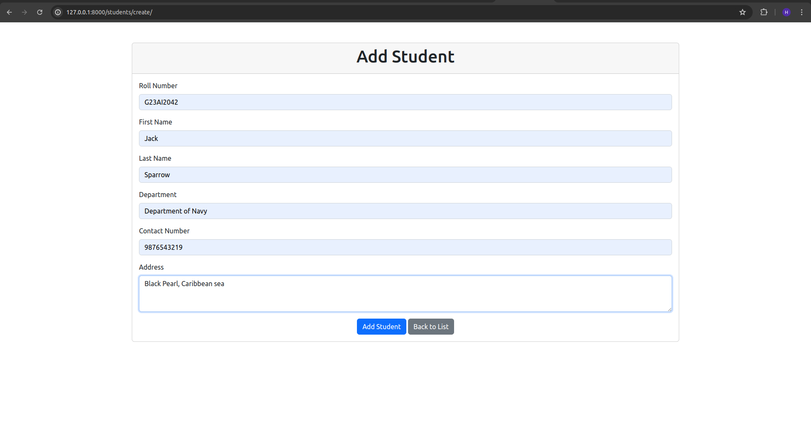

# VCC Assignment-1


## 🚀 About Me
Name: Harshal Shinde\
Roll No: G23AI2045

Hi, I'm Harshal Shinde, a student at IIT Jodhpur from the 2024-25 batch.\
This project is part of my Virtualization and Cloud Computing assignment.


## About Project - Student Management Web Application.
This project is a simple web application built with Django that stores and fetches student data including roll number, first name, last name, department, contact, and address. The application is styled using the latest Bootstrap CDN.

## Setup Instructions

### Prerequisites

- Docker
- Python 3.x
- Django

### To run the container, follow these steps:

1. **Clone the repository:**

   ```bash
   git clone https://github.com/harshalshinde437/iitj-assignments.git
   cd assignment_1
   ```
2. **Build the docker image**
    ```bash
    docker build -t assignment_1 -f Dockerfile .
    ```
3. **Run docker Container**
    ```bash
     docker run -p 8000:8000 assignment_1
    ```
4. **After which open the browser and type the following thing in the browser**
    ```
    http://localhost:8000/
    ```

## Screenshots

1. Build Docker image to the local.\
    


2. Check generated Docker image to the local.\
    

3. Docker Run container\
    


4. Accessing application in web browser\
    


5. Add_Data to application.\
    
